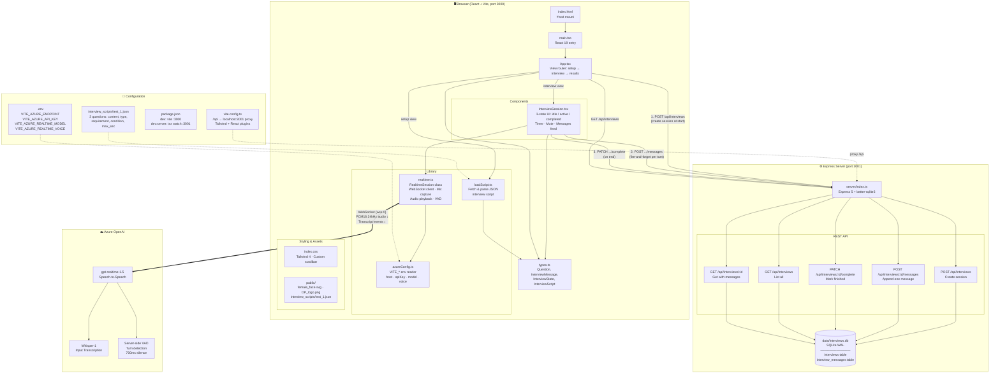
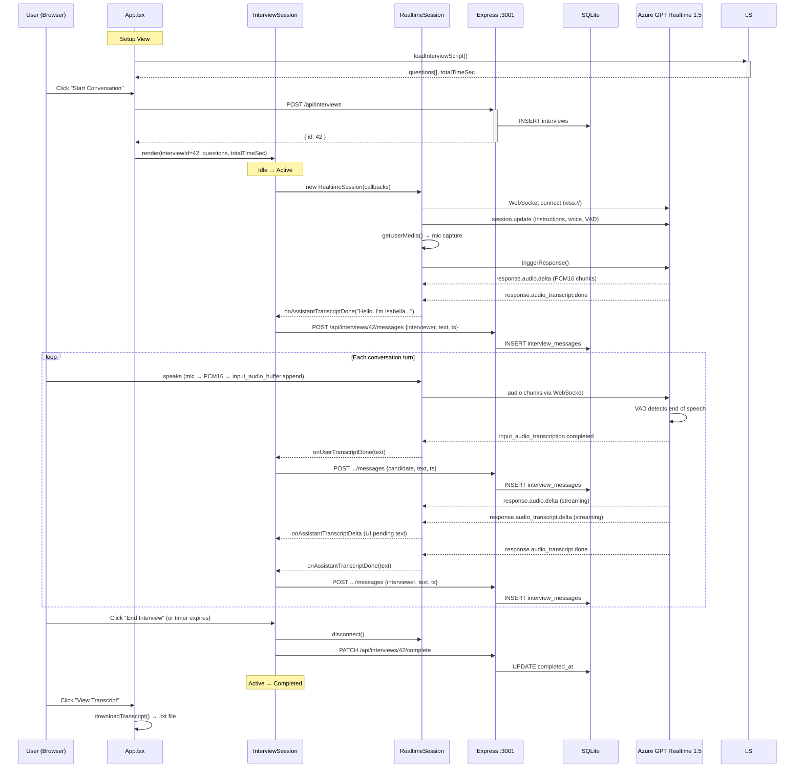

# gabm-ai-interviewer — Software Architecture

> **Last updated:** 2026-04-15 — Incremental message persistence

## Architecture Diagram

## Interview Lifecycle (Sequence)

## Component & File Map

| Layer | File | Role |
|-------|------|------|
| **Entry** | `index.html` → `src/main.tsx` | HTML shell, React 19 mount |
| **Router** | `src/App.tsx` | 3-view state machine (setup / interview / results) |
| **UI** | `src/components/InterviewSession.tsx` | Interview conductor — idle/active/completed states, timer, mute toggle, message feed |
| **Realtime** | `src/lib/realtime.ts` | WebSocket client for Azure GPT Realtime — mic capture (PCM16 24kHz), audio playback, transcript callbacks, server-side VAD |
| **Config** | `src/lib/azureConfig.ts` | Reads `VITE_*` env vars → `{ host, apiKey, realtimeModel, realtimeVoice }` |
| **Script** | `src/lib/loadScript.ts` | Fetches + parses JSON interview script → `Question[]` + `totalTimeSec` |
| **Types** | `src/types.ts` | `Question`, `InterviewMessage`, `InterviewState`, `InterviewScript`, `RawQuestion` |
| **Style** | `src/index.css` | Tailwind 4 import, custom scrollbar, body defaults |
| **Backend** | `server/index.ts` | Express 5 + better-sqlite3 — 5 REST endpoints for interview persistence |
| **Database** | `data/interviews.db` | SQLite WAL — `interviews` + `interview_messages` tables |
| **Assets** | `public/`, `icons/` | Isabella avatar, OP logo, interview script JSON |
| **Config** | `.env`, `vite.config.ts`, `tsconfig.json` | Azure creds, Vite proxy (`/api` → `:3001`), TypeScript |

## Tech Stack

| Category | Technology | Version |
|----------|-----------|---------|
| Frontend | React | 19 |
| Build | Vite | 6 |
| Language | TypeScript | 5.8 |
| Styling | Tailwind CSS | 4.1 |
| Animation | Motion (Framer) | 12.23 |
| Icons | Lucide React | 0.546 |
| Markdown | react-markdown | 10.1 |
| Backend | Express | 5.2 |
| Database | better-sqlite3 | 12.9 |
| AI Model | Azure OpenAI GPT Realtime 1.5 | — |
| Transcription | Whisper-1 (server-side) | — |
| Audio | PCM16, 24kHz, WebSocket | — |

## Changelog

| Date | Change |
|------|--------|
| 2026-04-15 | Incremental message persistence (per-turn POST, PATCH complete) |
| 2026-04-15 | Express + SQLite backend with 5 REST endpoints |
| 2026-04-15 | JSON-driven interview scripts (`loadScript.ts`) |
| 2026-04-14 | Isabella persona + OP LAB rebrand (orange theme) |
| 2026-04-14 | Azure GPT Realtime 1.5 speech-to-speech pivot |
| 2026-04-14 | Initial React + Vite scaffold |
